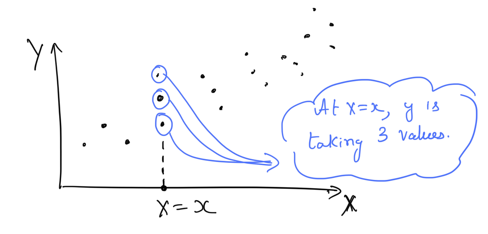
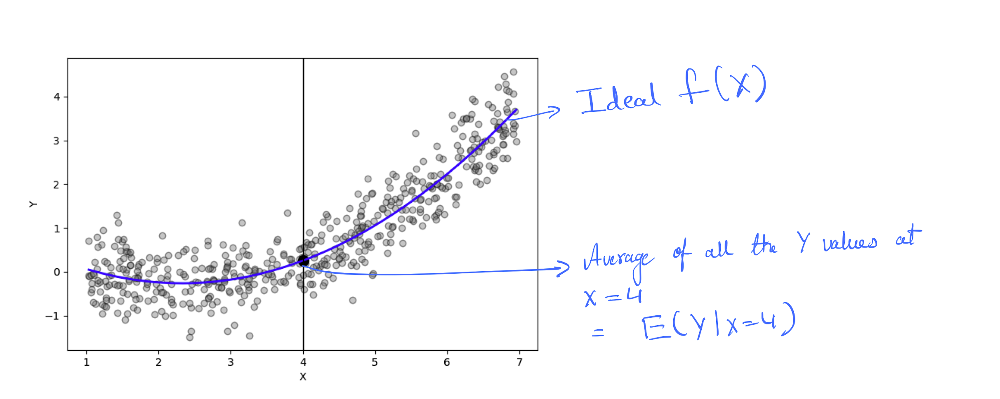
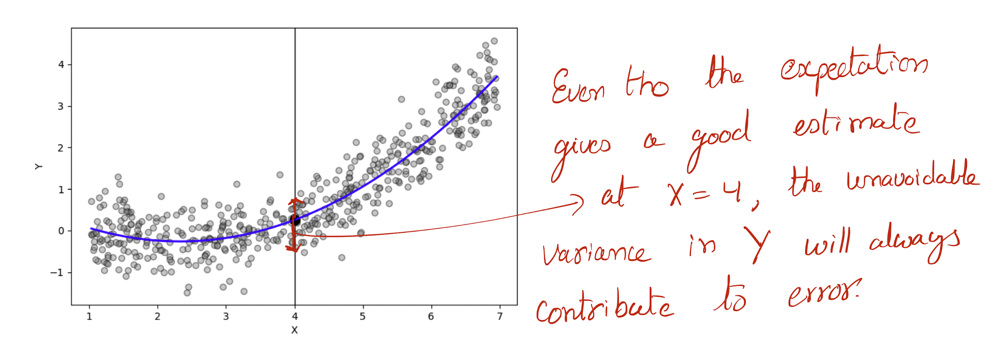

#+title:      Regression
#+date:       [2025-03-02 Sun 09:32]
#+filetags:   :regression:
#+identifier: 20250302T093253
#+HUGO_BASE_DIR: ~/Dropbox/notes/hugo-notes/
#+HUGO_SECTION: statistics
#+hugo_custom_front_matter: :math true

* Definition

We have output variable \(Y\) and vector of \(p\) independent input
variables \(X\).

\begin{equation}
X = 
\begin{bmatrix}
    X_1 \\
    X_2 \\
    X_3 \\
    \vdots \\
    X_p
\end{bmatrix}
\end{equation}

In Regression problem the variables are quntitative (that means \(Y\)
and \(X\) can be represented using numeric values.). We represent the
relationship between \(X\) and \(Y\) using a regression function \(f\) and
error \(\epsilon\).

\begin{equation}
Y = f(X) + \epsilon
\end{equation}

The goal here is to estimate \(f\).

** Notes

1. An instance of \(X\) is prepresented using \(x\).

\begin{equation}
x = 
    \begin{bmatrix}
    x_1\\
    x_2\\
    x_3\\
    \vdots \\
    x_p
    \end{bmatrix}
\end{equation}

1. An instance of \(Y\) is prepresended using \(y\) (at this point \(y\) is univariate ???true?).

2. Typically there can be multiple values for \(y\) at same \(x\). Below figure shows an example
   when \(p = 1\).

3. An instance of \(x\) may have multiple values of \(y\).

   #+CAPTION: At an instance of \(x\) we may have multiple \(y$\) values.
   #+ATTR_ORG: :width 500
   #+ATTR_LATEX: :width 0.8\textwidth
   #+ATTR_HTML: :width 600px
   

* Ideal regression function

An ideal $f(X)$ at $X = x$ with regard to mean-squared perdiction
error is $E(Y|X=x)$. This is called *conditional expectation*. This
function is theoritical and not estimated from data. In practice we
will not have data at every $X = x$.

#+CAPTION: Ideal $f(X)$. ([[file:scripts/regression_plot.py][code]])
#+ATTR_ORG: :width 500
#+ATTR_LATEX: :width 0.8\textwidth
#+ATTR_HTML: :width 600px

When there are $p$ predictors,

\begin{equation}
f(X) = E(Y|X_1 = x_1, X_2 = x_2, \dots, X_p = x_p)
\end{equation}

* Estimate regression function

An estimate of $f(X)$ using data is represented using /"hat"/,
$\hat{f}(X)$.

* Error

** Irreducible error ($\epsilon$)

$\epsilon = Y - f(X)$ is the irreducible error. Even tho, we know
the ideal function $f(X)$ at each $X=x$ we still make prediction
errors. This is happens due to the presense of distributions of $Y$
values at each $X=x$.

#+CAPTION: The unavoidable error, $\epsilon$.
#+ATTR_ORG: :width 500
#+ATTR_LATEX: :width 0.8\textwidth
#+ATTR_HTML: :width 600px

** Error of estimate $\hat{f}(X)$

The sum of squared error when using the estimate $\hat{f}(X)$ can be
split into two error components, (1) reducible error and (2)
irreducible error.

\begin{equation}
  E[(Y - \hat{f}(X))^2|X=x] = [f(x) - \hat{f}(x)]^2 + Var(\epsilon)
\end{equation}

- $[f(x) - \hat{f}(x)]^2$ is reducible
- $Var(\epsilon)$ is irreducible.
  
* Nonparametric regression

- [[file:20250302T185233--nearest-neighbour-averaging__nonparametric_regression_smoothing.org][Nearest neighbour]]

* Parametric regression

- [[file:20250302T191540--linear-regression__parametric_regression.org][Linear regression]]
