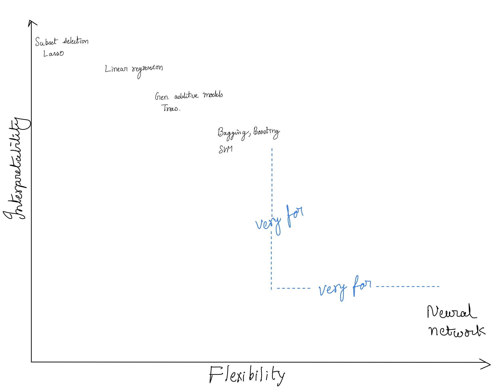

#+title:      interpretability vs flexibility
#+date:       [2025-03-07 Fri 07:42]
#+filetags:   :tradeoff:
#+identifier: 20250307T074254
#+HUGO_SECTION: statistics
#+HUGO_BASE_DIR: ~/Dropbox/notes/hugo-notes/
#+hugo_custom_front_matter: :math true

* Interpretability vs flexibility

- *Interpretability:* The ability of the model to provde insight
  into the response based on input variables.

- *Flexibility:* The ability of the model to capture variance in the
  training data.

Typically,

\begin{equation}
Interpretability \propto \frac{1}{Flexibility}
\end{equation}

   #+CAPTION: Interpretability vs flexibility
   #+ATTR_ORG: :width 500
   #+ATTR_LATEX: :width 0.8\textwidth
   #+ATTR_HTML: :width 600px
   

