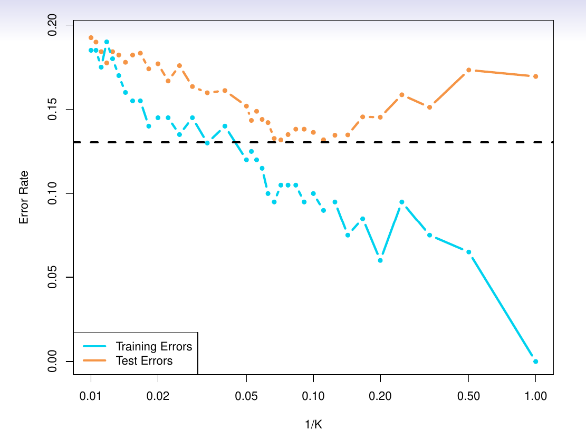
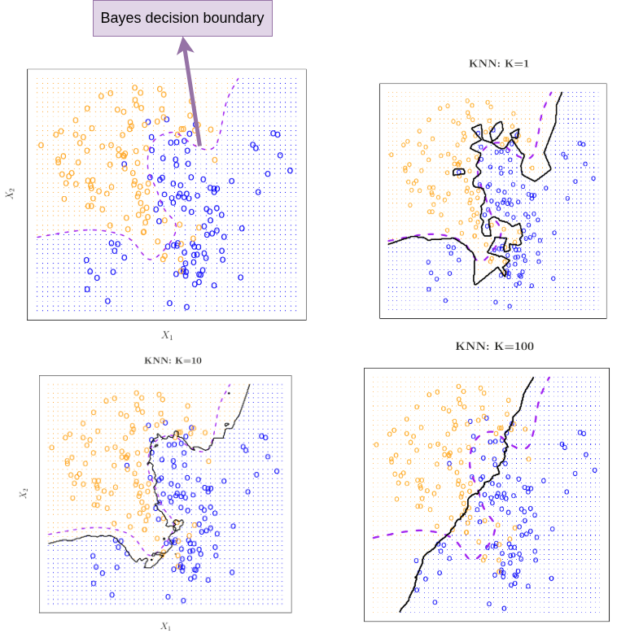

#+title:      K-nearest neighbors
#+date:       [2026-02-05 Thu 07:31]
#+filetags:   
#+identifier: 20260205T073140

This [[denote:20260204T202410][Nearest-neighbor]] algorithm defines the neighborhood $\mathcal(N)$
to contain $K$ samples from training data.

The algorithm is:
1. Find $K$ samples from training data nearest to $x_0$ (test predictor).
2. Count the occurrence of each class in this neighborhood.
3. $\hat{y}_0$ is given the label with the highest count.

** Training and testing error rates with $K$

The K increases, the [[denote:20260204T063317::*Error rate][training error rate]] increases. At $K=1$ the
training error rate is the lowest (overfits training data).

But, the testing error decreases with increasing $K$, reaches a lowest
point, and then again shoots up. When $K=N$, all the test predictions
will take the label (majority class in training data).

#+CAPTION: Training and testing error rate trend with $K$
#+NAME:   fig:knn_train_test_error_trend
#+ATTR_HTML: :width 50%

** Decision boundary

The decision boundary is where a classifier decision changes
from one class label to another.

In the simulated example demonstrated below, the first image
shows Bayes decision boundary. This is available to us only
because we know the conditional probability (as the data
is simulated). This Bayes decision boundary marks points where
the probability of each class is $0.5$.

#+CAPTION: Decision boundary trend with $K$
#+NAME:   fig:knn_decision_boundary
#+ATTR_HTML: :width 50%

